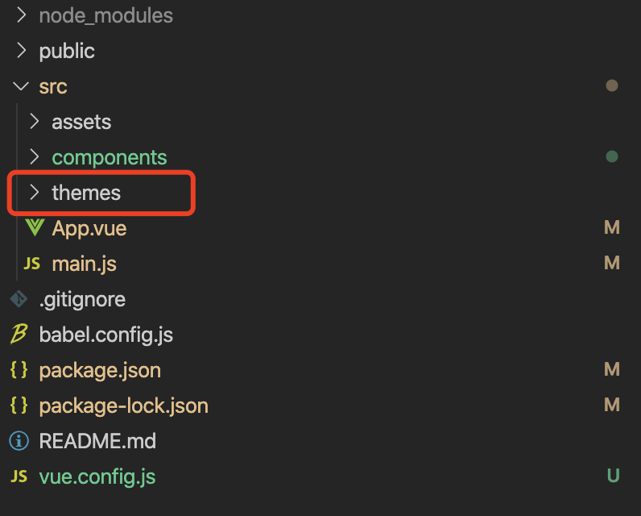
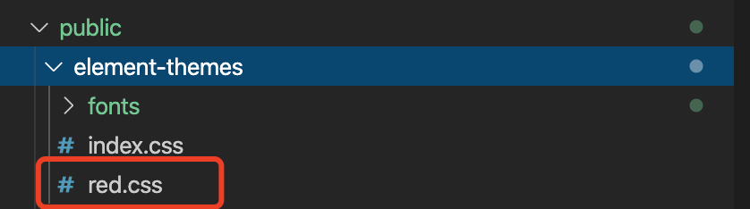
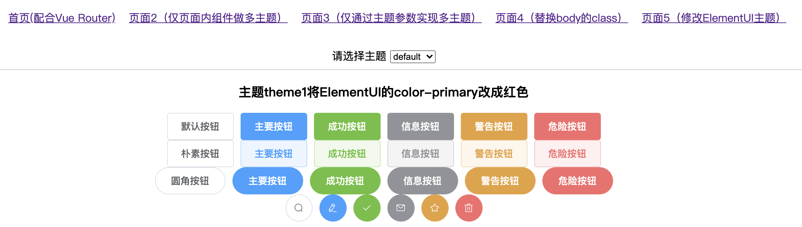
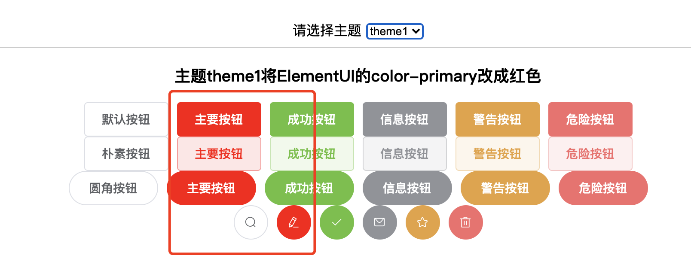

[TOC]

# 一、使用插件

## Step1 安装

```bash
npm install vue-multi-theme -S
```

## Step2 添加主题主目录

在main.js所在的目录添加themes目录



## Step3 注册插件

main.js

```js
...
import VueMultiTheme from 'vue-multi-theme'
...
Vue.use(VueMultiTheme, {
  themeConfigs: require.context(
    './themes',
    true,
    /\/.*\/index\.js$/
  ),
  // themeName: 'theme1'
})
...
```

插件参数说明：

|参数|说明|必填|
|:--|:--|:--|
|themeConfigs|要注册的主题列表，可以是对象{theme1:import theme1/index.js，theme2:import theme2/index.js}(伪代码)，或像上面那样用webpack的require.context传入（推荐）|YES|
|themeName|设置当前要渲染的主题。若不填，则渲染默认主题；可以通过调用组件的this.$setTheme修改，修改后界面自动更新|NO|
|themeOptions|主题参数，若设置会覆盖默认主题参数的对应字段，所有组件可以通过this.themeOptions获取当前主题的参数；也可以在组件中调用this.$setThemeOptions修改主题参数，修改后界面自动更新|NO|
|onThemeChanged|切换主题完成后的回调，参数1为新主题的参数，参数2为一个加载外部css的函数|NO|


## Step4 创建主题

在themes目录中创建主题目录，内容如下：

```
├── main.js
└── themes
    ├── theme1
    │   └── index.js
    ├── theme2
    │   └──index.js
    └── theme3
        └── index.js
```

其中index.js内容如下

```js
export default {
  components: {},
  options: {},
  styles: [],
  externalCss: []
}
```

|字段|说明|是否必须|
|:--|:--|:--|
|components|当前主题自定义的组件列表，只有添加到这里的组件才能被渲染组件（ThemeRender）渲染|NO|
|options|主题参数，参数的内容完全由你的实际需要决定，因为你能在所有组件的this.themeOptions访问到它|NO|
|styles|当前主题的基本样式模块列表，后详述|NO|
|externalCss|当前主题要加载的外部css文件列表|NO|


# 二、主题基本样式加载

我们在theme1目录中添加base.css:

```css
.theme-theme1 div {...}
.theme-theme1 h1 {...}
...
```

然后在theme1/index.js中设置：

```js
export default {
   ...
   styles: [() => import('./base.css')],
}
```

这样当我们调用**this.$setTheme**或通过插件初始化的**themeName**参数设置主题时，**base.css**就会被加载进来。

要特别注意这里的**.theme-theme1**，**base.css**中的所有样式都应该与这个class有关联，这是因为当前主题会将body的className设置为“**theme-主题名**”，这里是通过body的这个className的不同名称来区分主题的。

你还可以使用less、stylus等预编译样式。若webpack相关loader缺失，请自行安装配置。

```css
styles: [() => import('./base.less')]
或
styles: [() => import('./base.styl')]
```


# 三、ElementUI、iView、Vux等的动态主题

ElementUI、iView、Vux等官方一般都提供了修改主题的方法，但并没有提供动态加载的方法。

以ElementUI为例，我们打算当选择theme1时，ElementUI的color-primary变成红色。首先我们按照官方的方法生成一个red.css文件，然后把它存放在public/element-themes目录中（位置跟据自已需要）：



然后在theme1/index.js中设置：

```js
export default {
   ...
   externalCss: ['/element-themes/red.css']
}
```

这样当我们调用**this.$setTheme**或通过插件初始化的**themeName**参数设置主题时，**red.css**就可以被加载进来，而在切换到其它主题时它又会**被卸载掉**。效果如下：





iView、Vux同理。

**这个方法也能用来设置主题的基本样式，并且没有theme-theme1这个class的限制，这正是因为它在切换主题时会被卸载掉。但这种方法不能加载less和stylus等预编译样式，如何取舍看自己了。**


# 四、为主题定制组件

我们可以为某一个组件或页面在不同主题中定制不同的模板、样式和行为，为主题的定制提供更多的灵活性。

比如我们可以在默认的Component1.vue基础上为某一主题做Component1.vue定制：

themes/theme1/components/Component1.vue

```js
<script>
import Component1 from '../../../components/Component1'
export default {
  extends: Component1 // 继承默认主题
}
</script>
```

然后修改theme1/index.js:

```js
export default {
  components: {
    Component1: () => import('./components/Component1'),
  },
  ...
}
```

然后在原来用到Component1这个组件地方做如下修改：

```js
<template>
  <div>
	...
    <Component1/>
  </div>
</template>

<script>
import Component1 from './Component1'
export default {
    components: {
        Component1
    }
}
</script>
...
```
将上面的代码改为：


```js
<template>
  <div>
	...
    <ThemeRender __component="Component1" :__default="component1()"/>
  </div>
</template>

<script>
import Component1 from './Component1'
export default {
    methods: {
        component1: () => Component1
    }
}
</script>
```

ThemeRender组件参数说明：


|参数|说明|
|:--|:--|
|__component|表示到当前主题中找到Component1组件并渲染|
|__default|表示如果在当前主题中找不到__component对应的组件，则渲染component1()返回的组件(即默认组件)|

这样，你就可以在不同主题里对Component1这个组件为所欲为了。当你想改变template时：

```js
<template>
	...
</template>
<script>
import Component1 from '../../../components/Component1'
export default {
  extends: Component1 // 继承默认主题
}
</script>
```

当你想改变样式时：

```js
<script>
import Component1 from '../../../components/Component1'
export default {
  extends: Component1 // 继承默认主题
}
</script>
<style scoped>
	...
</style>
```

当你想改变按钮事件时：

```js
<script>
import Component1 from '../../../components/Component1'
export default {
  extends: Component1, // 继承默认主题
  methods: {
    btnClick: function() {
      ...
    }
  }
}
</script>
```

你可能会问：我不想继承行不行：

```js
extends: Component1 // 不写这一行
```

Of course，没有任何问题，就是完全写了一另一个组件。

我们还可以在Vue Router中使用ThemeRender:


routes.js
```js
import {themeRouteProps, ThemeRender} from 'vue-multi-theme'
import Home from './components/Home' // 默认Home
...

export default [
    {path: '/', name:'home', component: ThemeRender, props: themeRouteProps('Home', Home) },
	...
];
```

这样，当你在某一主题中有对Home定制，且当前主题是该主题时，就会自动渲染这个主题下的Home

themeRouteProps函数的参数：

|参数|说明|
|:--|:--|
|参数1|对应ThemeRender的__component参数|
|参数2|对应ThemeRender的__default参数|
|参数3|其它props（如果有的话）|

**由于组件在theme1/index.js中是使用import()函数引入的，因此这些组件及样式是在选择主题时才被加载进来的。**

# 五、主题参数

theme1/index.js中的：

```js
export default {
    options: {
        ...
    }
}
```

是主题的参数，这些参数可以在组件中通过**this.themeOptions**得到，我们可以在这里面设置一些和主题相关的信息，比如主题的中文名、logo等：

```js
export default {
  ...
  options: {
    cnName: '仅修改默认Home的样式',
    logo: `url(${require('./res/logo.png')})`,
    ...
  },
  ...
}
```

然后就可以组件中使用它们了。


# 六、API

**Vue.prototype.$setTheme**：设置当前主题，设置完成后，界面自动更新。

|参数|说明|
|:--|:--|
|参数1|要设置的主题的名称|
|参数2|主题在参数，会覆盖默认参数|

示例

```js
this.$setTheme('theme1')
```


**Vue.prototype.$setThemeOptions**：设置当前主题的参数，设置完成后，界面自动更新。

|参数|说明|
|:--|:--|
|参数1|要设置的参数|

示例

```js
this.$setThemeOptions({cnName: '新的名称'})
```

注意：主题的name参数是自动添加的，不可修改


**this.themeOptions**：获取当前主题参数

示例：

```js
<script>
...
export default {
  ...
  methods: {
    btnClick: function() {
      alert(`当前主题${this.themeOptions.name}`)
    }
  }
}
</script>
```


# 七、下载示例

你可以在：[https://github.com/Ajiaxi/vue-multi-theme/tree/master/examples](https://github.com/Ajiaxi/vue-multi-theme/tree/master/examples)查看示例，也可以下载运行示例：

```bash
$ git clone https://github.com/Ajiaxi/vue-multi-theme.git
$ cd vue-multi-theme
$ npm install
$ npm run serve
```

# 八、结语


新写的插件，可能会有bug和不完善的地方，需要在真正的项目中去检验，有问题可以到[https://github.com/Ajiaxi/vue-multi-theme/issues](https://github.com/Ajiaxi/vue-multi-theme/issues)反馈，我有空的话，想办法解决。


