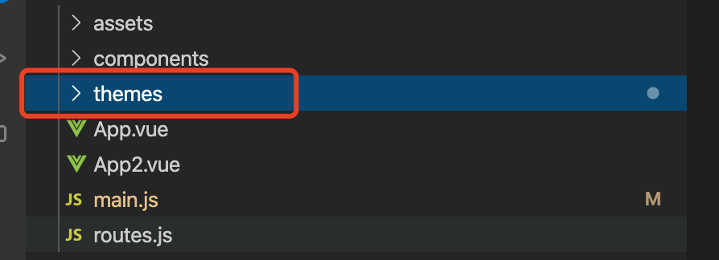
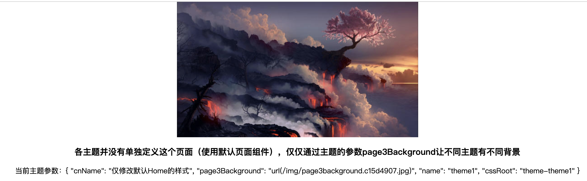
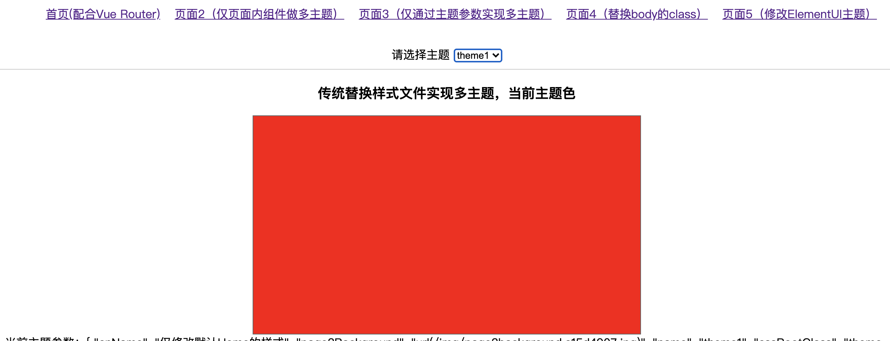
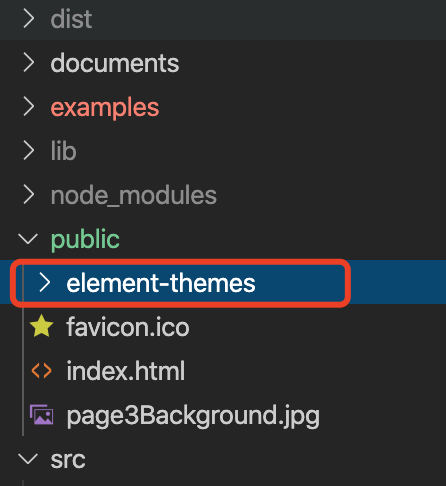

[TOC]

# 一、插件说明

本插件为vue多主题管理插件，网上大多数的主题管理多从样式管理入手（class切换、编译时多主题全量构建、编译时选择性构建、less变量、css变量、import动态加载样式等），而本插件将从完全不同的角度来实现多主题管理。插件要完成的目标：

1. 已有不支持多主题的项目，通过少量的改动，就能快速实现多主题。
2. 各主题之间实现松耦合，不用当心修改了A主题影响B主题
3. 工程化的主题开发，每个主题有单独的目录、资源、主题参数，可以多人同时做不同主题开发，增加新主题仅需要复制一个主题目录，然后改一改就可以了。
4. 主题开发灵活，组件在不同主题可以有不同样式、template、资源、事件行为等。
5. 支持默认页面和组件，即：同一页面和组件，有的主题需要做开发，有的不需要，这时不做开发的主题就会渲染默认的页面和组件
6. 主题支持参数，对于那些布局相同，主题间仅仅是背景图片、图标、文字及少量样式有差异的页面和组件，可以通过在组件中访问主题的参数（this.themeOptions）变量化实现多主题。
7. 可以在组件中调用this.$setTheme动态修改当前主题及调用this.$setThemeOptions修改主题参数。修改后界面自动更新。

* 本插件适合主题量大、主题间差异巨大的项目。由于较灵活，所有可能上手会比较慢，我尽量将案例写完善。
* 本插件是这几天刚做出来的，有些Bug可能没能及时测出来，若使用过程中有什么问题或意见可以通过[https://github.com/Ajiaxi/vue-multi-theme/issues](https://github.com/Ajiaxi/vue-multi-theme/issues)反馈， 我会抽时间看，当然不一定能马上改，除非很致命的bug。
* 本插件使用环境：webpack+vue2.0
* 本插件目前仅支持SPA应用，反馈好的话后续可能会研究对SSR的支持。
* 本插件会一次性注册所有主题（但组件是动态加载的）意味着别人可能通过浏览器调试知道你的所有主题，如果你不愿意让别人知道你有哪些主题，可以先不使用；后续会考虑添加使用时注册支持。


# 二、使用插件

## Step1 安装

```bash
npm install vue-multi-theme -S
```

## Step2 添加主题主目录

在main.js所在的目录添加themes目录



## Step3 注册插件

main.js

```js
...
import VueMultiTheme from 'vue-multi-theme'
...
Vue.use(VueMultiTheme, {
  themeConfigs: require.context(
    './themes',
    true,
    /\/.*\/index\.js$/
  ),
  // themeName: 'theme1'
})
...
```

插件参数说明：

|参数|说明|必填|
|:--|:--|:--|
|themeConfigs|要注册的主题列表，可以是对象{theme1:import theme1/index.js，theme2:import theme2/index.js}(伪代码)，或像上面那样用webpack的require.context传入（推荐）|YES|
|themeName|设置当前要渲染的主题。若不填，则渲染默认主题；可以通过调用组件的this.$setTheme修改，修改后界面自动更新|NO|
|themeOptions|主题参数，若设置会覆盖默认主题参数的对应字段，所有组件可以通过this.themeOptions获取当前主题的参数；也可以在组件中调用this.$setThemeOptions修改主题参数，修改后界面自动更新|NO|


# 三、添加第一个主题

假设此时你的项目如下：

```
.
├── App.vue
├── assets
│   └── logo.png
├── components
│   └── Home.vue
...
```

Home.vue内容如下：

```js
<template>
  <div>
    <h1>默认界面：{{msg}} 当前主题 {{themeOptions.name}} {{themeOptions.cnName}}</h1>
    <button @click="btnClick">按钮1</button>
    <slot></slot>
  </div>
</template>

<script>

export default {
  props: {
    msg: String
  },
  methods: {
    btnClick: function () {
      alert('Hello 我是默认主题的按钮事件')
    }
  }
}
</script>

<style scoped>
h1 {
  margin: 40px 0 0;
  color: blue;
}
</style>

```

App.vue内容如下：

```js
<template>
  <div id="app">
    <Home/>
  </div>
</template>

<script>
import Home from './components/Home'
export default {
  name: 'App',
  components: {
    Home
  }
}
</script>
...
```

运行效果：


点击按钮1弹出提示窗口“Hello 我是默认主题的按钮事件”


那么我们如果将这个Home.vue做成多主题呢

## Step 1 创建主题目录

在themes目录下创建第一个主题目录，其结构如下：

```
├── main.js
└── themes
    └── theme1
        ├── components
        ├── index.js
        └── res
```

|文件|是否是目录|说明|
|:--|:--|:--|
|index.js|NO|主题的配置文件|
|components|YES|主题使用到的组件|
|res|YES|主题用到的资源|


其中index.js内容如下

```js
export default {
  components: {
  },
  options: {
  }
}
```

|字段|说明|
|:--|:--|
|components|要导出给主题渲染组件(ThemeRender)渲染的组件列表，只有添加到这里的组件才能被渲染组件渲染|
|options|主题参数，参数的内容完全由你的实际需要决定，因为你能在所有组件的this.themeOptions访问到它|

## Step 2 添加主题组件

我们在theme1/components目录中创建Home.vue, 内容如下：

```js
<script>
import Home from '../../../components/Home'
export default {
  extends: Home
}
</script>
```
可以看到，这里通过Vue的extends继承了默认的Home。此时，我们就在theme1主题中添加了一个和原来的Home.vue一模一样的组件，然后将这个组件添加到theme1/index.js中：

```js
export default {
  components: {
    Home: () => import('./components/Home')
  },
  options: {
    cnName: '仅修改默认Home的样式' // 并且在这里添加上cnName字段（仅做示例，非必填）
  }
}
```

备注：import('./components/Home')返回的是一个Promise对象

此时，我们的第一个主题就创建完成了。

## Step 3 使用主题

接下来就可以将插件注册时的// themeName: 'theme1'前的注释去掉：

main.js

```js
Vue.use(VueMultiTheme, {
  themeConfigs: require.context(
    './themes',
    true,
    /\/.*\/index\.js$/
  ),
  themeName: 'theme1'
})
```
这样我们就默认加载theme1主题了。接下来修改App.vue内容

```js
<template>
  <div id="app">
    <ThemeRender __component="Home" :__default="home()" msg="哈哈，这是一条消息"/>
  </div>
</template>

<script>
import Home from './components/Home'
export default {
  name: 'App',
  methods: {
    home: () => Home
  }
}
</script>
```
将原来的

```html
<Home/>
```

修改为

```html
<ThemeRender __component="Home" :__default="home()" msg="哈哈，这是一条消息"/>
```

|参数|说明|
|:--|:--|
|__component|表示到当前主题中找到Home组件并渲染|
|__default|表示如果在当前主题中找不到__component对应的组件，则渲染home()返回的组件|

至此，我们的第一个主题已完成，运行结果：


我们可以看到主题的界面显示出来了，msg参数也顺利传给了Home组件，而Home中的{{themeOptions.name}}和{{themeOptions.cnName}}也成攻取到主题参数的值。

# 四、不同类型的主题开发

## 1 不同主题间的组件仅是样式不同

假设我们要在theme1的Home中将上面蓝色的文字改成红色，由于theme1的Home是从點认的Home继承过来的，因此我们完全可以重写它样式：

```js
<script>
import Home from '../../../components/Home'
export default {
  extends: Home
}
</script>

<!-- 仅修改样式 -->
<style scoped>
h1 {
  margin: 40px 0 0;
  color: red;
}
</style>
```

在Home.vue中加入style标记，这样我们就能覆盖掉默认的样式了，运行效果


## 2 不同主题间同一组件长得完全不一样

有这么一种情况：比如网站首页，不同主题长得完全是不沾边；又比如同一页面，PC版和Wap版可能差别巨大。这时如果仅通过样式去调就会显得比较吃力，也比较谨慎。

我们将theme1目录复制一分出来，取名theme2。同理，由于theme2的Home是从點认的Home继承过来的，因此我们完全可以重写模板(template)：

```js
<template>
  <div>
    <h3>你好，我是主题 {{themeOptions.name}} 的Home</h3>
    <div class="content">
      <div>我长得和默认的Home完全不一样</div>
      <ul>
        <li>列表项1</li>
        <li>列表项2</li>
        <li>列表项3</li>
      </ul>
    </div>
    <slot></slot>
  </div>
</template>
<script>
import Home from '../../../components/Home'
export default {
  extends: Home
}
</script>
<style scoped>
.content {
  margin: auto;
  width: 400px;
  height: 200px;
  background: #ccc;
}
ul {
  margin: auto;
  width: 100px;
}
</style>
```

然后，我们将注册插件的themeName参数改为theme2

main.js

```js
Vue.use(VueMultiTheme, {
  themeConfigs: require.context(
    './themes',
    true,
    /\/.*\/index\.js$/
  ),
  themeName: 'theme2'
})
```
运行效果


## 3 不同主题同一组件有不同行为

我们打算改变Home中"按钮1"的行为。依然将theme1目录复制一分出来，取名theme3，修改Home.vue代码如下：

```js
<script>
import Home from '../../../components/Home'
export default {
  extends: Home,
  methods: {
    btnClick: function() {
      alert(`请注意哦，我是主题${this.themeOptions.name}的按钮事件`)
    }
  }
}
</script>
```

theme3/index.js内容如下

```js
export default {
    components: {
        Home: () => import('./components/Home')
	},
    options: {
        cnName: '重定义按钮的行为'
    }
}
```

修改插件参数themName为theme3

main.js

```js
Vue.use(VueMultiTheme, {
  themeConfigs: require.context(
    './themes',
    true,
    /\/.*\/index\.js$/
  ),
  themeName: 'theme3'
})
```

运行结果


点击“按钮1”结果


可以看到按钮的行为改变了

## 4 页面内的部分组件做多主题

有时候一个页面我们并不需要整个页面都做多主题，而只是页面中的某些组件需要。

我们在components目录中新建一个Page2.vue文件，内容如下：

Page2.vue
```js
<template>
  <div>
    <div>页面2</div>
    <ThemeRender __component="Component1" :__default="component1()">
      <div class="sub-com">子DIV</div>
    </ThemeRender>
  </div>
</template>

<script>
import Component1 from './Component1'
export default {
    methods: {
        component1: () => Component1
    }
}
</script>

<style scoped>
  .sub-com {
    margin: auto;
    width: 400px;
    line-height: 400px;
    background:white;
    color: black;
  }
</style>
```


对应的，在Page.vue同级目录添加Component1.vue文件:

Component1.vue

```js
<template>
    <div class="com1">
        <h3>这是默认主题的组件1</h3>
        <slot></slot>
    </div>
</template>

<script>
    export default {
    }
</script>

<style scoped>
.com1 {
    color: white;
    background: black;
    width: 100%;
    height: 500px;
    font-size: 24px;
    font-weight: bold;
}
</style>
```


程序运行时，Page2的ThemeRender会到当前主题查找__component参数对应的组件（Component1）并渲染，如果在当前主题找不到这个组件，则渲染默认的Component1。


修改App.vue

```js
<template>
  <div id="app">
    <Page2/>
  </div>
</template>

<script>
import Page2 from './components/Page2'
export default {
  name: 'App',
  components:  {
    Page2
  }
}
</script>
...
```
可以看到，这里并没有使用ThemeRender来渲染Page2，因为Page2仅仅是里面的Component1需要做多主题，你可以在theme1中添加这个Component1组件：

themes/theme1/components/Component1.vue
```js
<template>
    <div class="com1">
        <h3>这是主题1的组件1</h3>
        <slot></slot>
    </div>
</template>

<script>
    export default {
    }
</script>

<style scoped>
.com1 {
    color: white;
    background: red;
    width: 100%;
    height: 500px;
    font-size: 24px;
    font-weight: bold;
}
</style>
```

然后在theme1/index.js中注册这个组件

```js
export default {
  components: {
    Home: () => import('./components/Home'),
    Component1: () => import('./components/Component1'),
	},
  options: {
	...
  }
}
```

这样，当你当前的主题是theme1时，就会渲染这个组件。运行效果


默认主题的Component1效果：


theme1的Component1效果


## 5 通过组件参数实现不同主题

有些页面不同主题间仅仅是一些背景图、文字、图标及有限的样式参数不同。这时就没必每个主题去继承组件了。而是通过主题间相应字段的不同值的配置就能实现。

我们创建一个全新的页面components/Page3.vue，这个页面不同主题仅仅是背景图片不一样。

Page3.vue

```js
<template>
  <div>
    <div class="page3" :style="{backgroundImage:themeOptions.page3Background}">
    </div>
    <h3>各主题并没有单独定义这个页面（使用默认页面组件），仅仅通过主题的参数page3Background让不同主题有不同背景</h3>
    <div>当前主题参数：{{JSON.stringify(themeOptions, null, 2)}}</div>
  </div>
</template>

<script>
export default {
}
</script>

<style scoped>
.page3 {
    margin: auto;
    width: 533px;
    height: 300px;
    font-size: 24px;
    font-weight: bold;
    color: red;
    background-repeat:no-repeat;
    background-image: url(/page3Background.jpg);
}
</style>
```

修改App.vue

```js
<template>
  <div id="app">
    <Page3/>
  </div>
</template>

<script>
import Page3 from './components/Page3'
export default {
  name: 'App',
  components:  {
    Page3
  }
}
</script>
...
```
可以看到这里也没有用ThemeRender来渲染Page3，因为我们仅仅是通过themeOptions来设置style中的backgroundImage，从而达到多主题效果，在项目的public中添加page3Background.jpg文件，运行效果：


这是默认主题Page3效果，此时我们想在theme1主题中改变这张图片，仅仅需要在theme1/index.js中这样设置：


```js
export default {
    components: {
      Home: () => import('./components/Home')
    },
    options: {
      page3Background: `url(${require('./res/page3background.jpg')})`,
      cnName: '仅修改默认Home的样式' // 并且在这里添加上cnName字段（仅做示例，非必填）
    }
  }
```

同时在themes/theme1/res中放入对应文件，将themeName改成theme1即可

运行效果



# 五、与Vue-Router配合使用

我们已经创建了页面多主题的Home.vue、页面中部分组件多题的Page2.vue、以及通过主题参数实现多主题的Page3.vue;接下来我们要通过router把它们串起来，方便看整体效果。

```bash
npm install vue-router -S
```


在这里插件为需要直接在route.js中配置多主题的页面提供了themeRouteProps方法，具体用法如下：

routes.js
```js
import {themeRouteProps, ThemeRender} from 'vue-multi-theme'
import Home from './components/Home'
import Page2 from './components/Page2'
import Page3 from './components/Page3'

export default [
    {path: '/', name:'home', component: ThemeRender, props: themeRouteProps('Home', Home) },
    {path: '/page2', name:'page2', component: Page2},
    {path: '/page3', name:'page3', component: Page3},
];
```

main.js
```js
...
import VueRouter from 'vue-router'
import routes from './routes'
...
Vue.use(VueRouter)

const router = new VueRouter({
  mode: 'history',
  routes
})

new Vue({
  render: h => h(App),
  router
}).$mount('#app')
...
```

App.vue

```js
<template>
  <div id="app">
    <router-view/>
  </div>
</template>

<script>
export default {
  name: 'App',
}
</script>
...
```

* Home在不同主题中都有定义，因此这里使用了ThemeRender来渲染，themeRouteProps的第一个参数是在当前主题中查找Home组件(对应\__component)，第二个参数是如果没找到第一个参数在主题中的组件时，要渲染的默认组件(对应\__default)，第三个参为其它props（如果有的话）

* Page2是内部的组件需要多主题渲染、Page3是仅通过主题参数来改变背景，因此它们都不需要使用ThemeRender配置，按正常配置即可。

为方便看效果，我们添加了Header.vue给Home、Page2和Page3使用

Header.vue

```js
<template>
    <header>
        <ul>
            <li><router-link to="/">首页(整个页面做多主题)</router-link></li>
            <li><router-link to="page2">页面2（仅页面内组件做多主题）</router-link></li>
            <li><router-link to="page3">页面3（仅通过主题参数实现多主题）</router-link></li>
        </ul>
        请选择主题
        <select v-model="themeName">
            <option v-for="item in themes" :value ="item" :key="item">{{item}}</option>
        </select>
    </header>
</template>

<script>
import {themeWebpackContextPaser} from 'vue-multi-theme'
const themeConfigs = themeWebpackContextPaser(require.context(
    '../themes',
    true,
    /\/.*\/index\.js$/
  ))
export default {
    data: function() {
        let themes = []
        for (let key in themeConfigs) {
            themes.push(key)
        }
        return {
            themes
        }
    },
    computed:  {
        themeName: {
            get: function () {
                return this.themeOptions.name
            },
            set: function (v) {
                this.$setTheme(v)
            }
        }
    }
}
</script>

<style scoped>
header {
  line-height: 40px;
  border-bottom: 1px solid #ccc;
}
ul, select {
    display: inline-block;
}
li {
    display: inline-block;
    margin: 0 10px;
    color: cornflowerblue;
}
li a {
    cursor: pointer;
}
</style>

```

将Header注册成全局的
main.js
```js
import Header from './components/Header'
...
Vue.component('Header', Header)
```

分别把这个Header.vue添加到Home、Page2和Page3中,最终效果


我们可以通过三个链接选择不同页面，同时可以通过主题下拉框查看页面在不同主题的效果。

# 六、传统替换class名称方式多主题支持(v0.1.3)

有些公共样式在同一主题中很多地方都有用到，且仅仅是样式的区别；这时我们还可以用传统的方式来设置多主题。

为展示这个用法，我们在./components中添加了Page4.vue：

```js
<template>
  <div>
    <Header/>
    <h3>传统替换样式文件实现多主题，当前主题色</h3>
    <div class="current-theme-color"></div>
    <div>当前主题参数：{{JSON.stringify(themeOptions, null, 2)}}</div>
  </div>
</template>

<script>
export default {
}
</script>

<style scoped>
.current-theme-color {
    width: 533px;
    height: 300px;
    margin: auto;
    border: 1px solid #666;
}
</style>
```

我们希望当我们选择theme1主题的时候，加载一个css文件来设置current-theme-color的值，首先我们在theme1目录中添加base.css:

```css
.theme-theme1 .current-theme-color {
    background: red;
}
```

然后修改theme1/index.js:

```js
export default {
  components: {
	...
  },
  options: {
	...
  },
   styles: [() => import('./base.css')],
}

```

这样当我们选择样式的时候，current-theme-color就会显示成红色，这是应为当我们设置主题时，插件会将body的className设置为“**theme-主题名**”，也因此base.css中的**样式一定要注意和这个className的联系**。

**注意：这种方式是支持热加载的，也就是说改了样式马上就能看到效果**

你还可以使用less、stylus等预编译样式：

```js
styles: [() => import('./base.less')]
或
styles: [() => import('./base.styl')]
```

当然，前提是webpack要配置好相关的loader。

效果：




# 七、ElementUI、iView、Vux等动态主题支持(v0.1.3)

ElementUI、iView、Vux等UI框架的样式在多是用less编写的，同时官方也提供了修改主题的方法，但并没有提供动态加载的方法。

以ElementUI为例，我们打算当选择theme1时，ElementUI的color-primary变成红色。为达成这个目标，我们首先在public目录创建一个element-themes子目录（名字可以自已取）:



然后我们用ElementUI官方提供的方法分别生成一个默认的index.css和一个color-primary为红色的red.css放在这个目录里面：


接着我们修改插件加载参数：

main.js

```js
...
Vue.use(VueMultiTheme, {
  ...
  onThemeChange: (themeOptions, loadExternalCss) => {

    let cssFile = 'index.css'

    // 如果主题是theme1，则ElementUI加载红色主题
    // 当然你也可以通过其它自定义的主题参数来确定要加载哪个文件
    if (themeOptions.name === 'theme1') {
      cssFile = 'red.css'
    }
    // 加载外部css到指定ID的link上，如果link已存在，则删除重建
    loadExternalCss('element-theme-link', `/element-themes/${cssFile}`)
  }
  ...
})
...
```

当我们切换主题时，会执行onThemeChange这个回调（如果有指定的话），它传入两个参数，一个是切换后的主题参数themeOptions，和用于加载外部css文件的函数loadExternalCss，它的功能是加载外部css到指定ID的link上，如果link已存在，则删除重建。第一个参数是link的id，第二个参数为css文件路径，运行效果：


iView、Vux同理。利用这个回调函数，我们还可以做很多事情。


# 八、下载示例

以上示例都在：[https://github.com/Ajiaxi/vue-multi-theme/examples](https://github.com/Ajiaxi/vue-multi-theme/examples)中，可以下载项目并运行。

运行示例：

```bash
$ npm run serve
```

# 九、结语

以上示例只是起到抛砖引玉作用。前期不理解使用起来可能会有点费劲，有的人可能会绝得麻烦，但理解之后相信对你会有所帮助。

传统的替换css和class name大法有可能在后续版本考虑引入。不过不推荐这么做。现在这样对于大多数SPA项目应该也够用了。

新写的插件，可能会有bug和不完善的地方，需要在真正的项目中去检验，有问题可以到[https://github.com/Ajiaxi/vue-multi-theme/issues](https://github.com/Ajiaxi/vue-multi-theme/issues)反馈，我有空的话，想办法解决。


